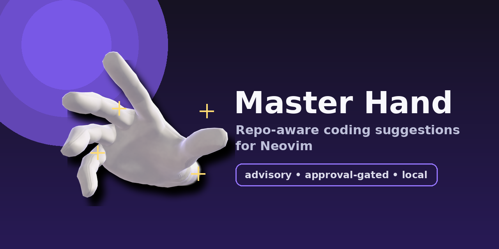

# Master Hand

<p align="center">
  
</p>

Master Hand is an experimental Neovim assistant that reads repo/editor context, infers your current coding goal, and suggests safe next steps. It never edits files or runs commands unless you approve an explicit pending action.

> [!WARNING]
> **This project is vibe-coded and lightly reviewed. Treat it as experimental until hardened.**

## Features

- Repo-aware context: buffers, diagnostics, git status/diffs, ripgrep, tree-sitter, local index.
- Model-backed suggestions: local heuristics plus OpenAI-compatible, OpenRouter, Ollama, or Anthropic providers.
- Non-blocking sidebar: `:MH` opens immediately; model suggestions load asynchronously with a spinner.
- Runtime model switching from inside Neovim via `:MHModel`.
- Safety-first actions: edits/commands are queued for approval and never run automatically.
- Tiling-WM-friendly sidebar: fixed width, resize clamp, `winfixwidth` support.

## Installation

Example `lazy.nvim` config:

```lua
{
  "artie-mortus/Master-Hand",
  name = "master-hand",
  config = function()
    require("master-hand").setup({
      proactivity = "advisory",
      model = { provider = "auto" },
    })
  end,
}
```

## Quick start

```vim
:MH                         " open sidebar; starts async suggestions if empty
:MHSuggest                  " refresh model-backed suggestions
:MHGoal Fix login redirect  " steer long-term goal
:MHModel                    " show active model
:MHModel qwen3-coder-local:latest
:MHModelStatus              " test model connection
```

Inside sidebar:

| Key | Action |
| --- | --- |
| `a` | Mark suggestion accepted/useful |
| `d` | Dismiss suggestion |
| `p` | Postpone suggestion |
| `v` | View details |
| `r` | Refresh suggestions |
| `q` | Close |

`a` records feedback only. It does **not** apply edits or run commands. Real work goes through pending actions plus `:MHApprove`.

## How suggestions work

Suggestions run in two stages:

1. Local heuristics inspect steering goals, diagnostics, git diff, related files, recent edits, and repo index.
2. Configured model reviews those local suggestions plus read-only code context and returns extra suggestions.

`:MH` shows the sidebar immediately. If suggestions are empty, Master Hand starts model-backed suggestion generation in the background and shows a loading spinner instead of blocking Neovim.

## Goal steering

Master Hand keeps steering intent instead of one hard task:

- Long-term goal captures user/project direction.
- Short-term goal captures immediate repo-aware work from recent edits, changed files, diagnostics, and repo state.
- The model can refine both goals from read-only context.
- `:MHGoal <goal>` sets long-term steering when inferred direction is wrong.

## Model providers

With `provider = "auto"`, Master Hand uses a local Ollama model when available, preferring coder/code/Qwen models. If no model is reachable, local heuristic suggestions still work. Use `provider = "none"` to disable model calls.

Cold local models can take time to load, so default model timeout is 60 seconds. Run `:MHModelStatus` to test provider connectivity.

### Change model in Neovim

```vim
:MHModel                  " show current model
:MHModel gpt-5.5          " OpenAI (sets endpoint + OPENAI_API_KEY)
:MHModel openai gpt-5.5
:MHModel qwen3-coder-local:latest
:MHModel ollama qwen3-coder-local:latest
:MHModel ollama-cloud gpt-oss:120b " Ollama Cloud (sets OLLAMA_API_KEY)
:MHModel openrouter anthropic/claude-3.5-sonnet
:MHModel anthropic claude-sonnet-4-20250514
:MHModel auto
:MHModel none
```

Model name alone is inferred: `gpt-4*`/`gpt-5*`/`o*` uses OpenAI; everything else uses local Ollama. For Ollama Cloud, use `ollama-cloud <model>` so Master Hand sets `https://ollama.com/api/chat` and `OLLAMA_API_KEY`. Advanced `key=value` form still works when needed:

```vim
:MHModel provider=openai model=gpt-5.5 endpoint=https://api.openai.com/v1/chat/completions api_key_env=OPENAI_API_KEY
:MHModel provider=ollama-cloud model=gpt-oss:120b
```

`:MHModel` changes runtime config for the current Neovim session. Add same model to `setup()` for permanent default.

### Config examples

OpenAI API:

```lua
require("master-hand").setup({
  model = {
    provider = "openai_compatible", -- OpenAI chat-completions wire format
    endpoint = "https://api.openai.com/v1/chat/completions",
    name = "gpt-5.5",
    api_key_env = "OPENAI_API_KEY",
  },
})
```

`openai_compatible` means API shape, not model vendor. For Qwen or `gpt-oss` via Ollama, use the native Ollama provider below.

Local Ollama:

```lua
require("master-hand").setup({
  model = {
    provider = "ollama",
    endpoint = "http://localhost:11434/api/chat", -- optional default
    name = "qwen3-coder-local:latest",
  },
})
```

Ollama Cloud:

```lua
require("master-hand").setup({
  model = {
    provider = "ollama",
    endpoint = "https://ollama.com/api/chat",
    name = "gpt-oss:120b",
    api_key_env = "OLLAMA_API_KEY",
  },
})
```

OpenRouter:

```lua
require("master-hand").setup({
  model = {
    provider = "openrouter",
    name = "anthropic/claude-3.5-sonnet",
    api_key_env = "OPENROUTER_API_KEY",
  },
})
```

Anthropic:

```lua
require("master-hand").setup({
  model = {
    provider = "anthropic",
    name = "claude-sonnet-4-20250514",
    api_key_env = "ANTHROPIC_API_KEY",
  },
})
```

## Commands

| Command | Alias | Description |
| --- | --- | --- |
| `:MasterHand` | `:MH` | Open sidebar; async-load suggestions if empty |
| `:MasterHandClose` | `:MHClose` | Close sidebar |
| `:MasterHandGoal <goal>` | `:MHGoal <goal>` | Set long-term steering goal |
| `:MasterHandPlan` | `:MHPlan` | Generate model-backed plan suggestions |
| `:MasterHandSuggest` | `:MHSuggest` | Refresh model-backed suggestions asynchronously |
| `:MasterHandModelSuggest` | `:MHModelSuggest` | Alias for `:MHSuggest` |
| `:MasterHandStatus` | `:MHStatus` | Print cached context summary |
| `:MasterHandModel [args]` | `:MHModel [args]` | Show/change runtime model config |
| `:MasterHandModelStatus` | `:MHModelStatus` | Test configured model connection |
| `:MasterHandContext` | `:MHContext` | Show cached context snapshot |
| `:MasterHandIndex` | `:MHIndex` | Show cached local repo index |
| `:MasterHandDiff [request]` | `:MHDiff [request]` | Prepare model-proposed diff |
| `:MasterHandApprove [id]` | `:MHApprove [id]` | Approve pending action |
| `:MasterHandReject [id]` | `:MHReject [id]` | Reject pending action |
| `:MasterHandRun <argv...>` | `:MHRun <argv...>` | Queue command for approval |
| `:MasterHandPending` | `:MHPending` | Show pending actions |
| `:MasterHandSearch <query>` | `:MHSearch <query>` | Search repo with ripgrep |

## Sidebar config

```lua
require("master-hand").setup({
  ui = {
    width = 46,
    max_width_ratio = 0.45,
    side = "right",
  },
})
```

The sidebar uses `winfixwidth` and reapplies width on `VimResized`, so i3/fullscreen terminal resizes should not stretch it across the editor.

## Safety model

- No automatic edits or command execution.
- Accepting a suggestion records feedback only.
- Diffs must pass `git apply --check` before approval and before apply.
- Commands use argv arrays, not shell strings.
- Shell metacharacters and dangerous commands are blocked.
- Pending diffs live in memory, not on disk.

## Testing

```sh
nvim --headless -u NONE -l tests/run.lua
```
